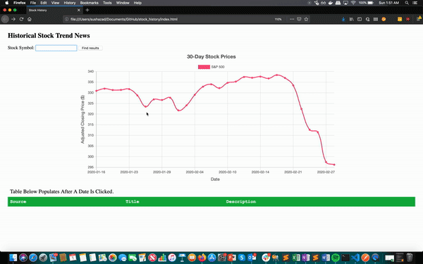

# Stock Spy

Analyze historical trends for any stock based on contextual, time-relevant news



### Problem 
Scenario: We would like to purchase Microsoft (MSFT) stocks, because it recently plunged. To decide whether this would be a good investment, we want to investigate:

1. Points where MSFT has dropped significantly in the past, and
2. Whether MSFT climbs back (quickly) after a drop like this.

While existing financial news sources, like MarketWatch or Robinhood, do show stock prices over time, they do not have readily-available historical news information about a stock. To find such trends, we must separately query for news about the stock over a relevant period of time in a news source or search engine.

### Overview
Stock Spy has the following capabilities:
* Retrieve ranked news articles for your stock of choice, on your date of choice
* Compare relevant growth or loss to the performance of market indicators, such as S&P 500
* Analyze cause of stock movement (whether it is related to company-specific developments or overall economic trends)

Our algorithm measures the relative difference between the S&P 500 trend and the stock we're interested in, normalized by their previous closing value. If the relative difference is low enough to reliably see that it's mimicking the markets, aggregated market news from that day is shown to us instead.


### Set Up
Please create a config.js file in the root of this folder, locally, to store your secret API keys. 

```
var config = { // this should be const instead if you're using ES6 standards
  news_api_key: 'INSERT_KEY_HERE',
  stocks_api_key: 'INSERT_KEY_HERE'
}
```
This project is licensed under the terms of the MIT license.

### TODO

- [ ] Weird rendering (before clicking date)
- [ ] Remove duplicate code for DOW vs STOCK

- [ ] Edge cases (symbol mapping not available, no news?)
- [x] Alter x and y-axes for dates
- [x] Axis labels
- [x] Better ranking of news API search results 
- [x] Search for news based on baseline comparison (difference from S&P and DOW)
- [x] Remove unused buttons
- [x] Change page title
- [x] Add search term indicator
- [ ] Better name!! 
- [ ] Catch clicking outside of lines
- [x] Center chart 
- [ ] Color-blind friendly color palette


#### Libraries and APIs 
* ChartJS: https://github.com/chartjs/Chart.js
* News API: https://newsapi.org/
* Alpha Vantage: https://www.alphavantage.co/
